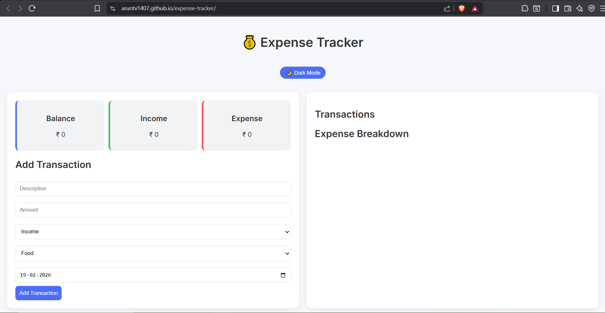

# 💰 Expense Tracker

This is a personal project I built to improve my JavaScript and frontend development skills.

## 🌐 Live Demo

👉 https://aruntv1407.github.io/expense-tracker/

---

## 📸 Preview

---

## 🚀 Features

- Add income and expense transactions
- Category-based tracking
- Full date selection
- Automatic balance calculation
- Pie chart visualization (Chart.js)
- Light/Dark mode
- Local storage support
- Fully responsive layout

---

## 🛠 Built Using

- HTML
- CSS
- JavaScript
- Chart.js

---

## 👨‍💻 Built By

Arun T V  
3rd Semester Computer Science Engineering  
Currently learning Web Development and building real-world projects.