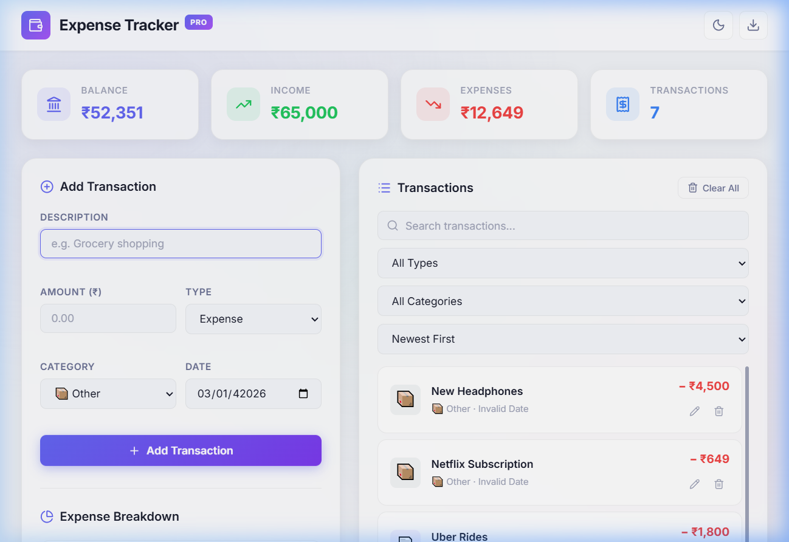
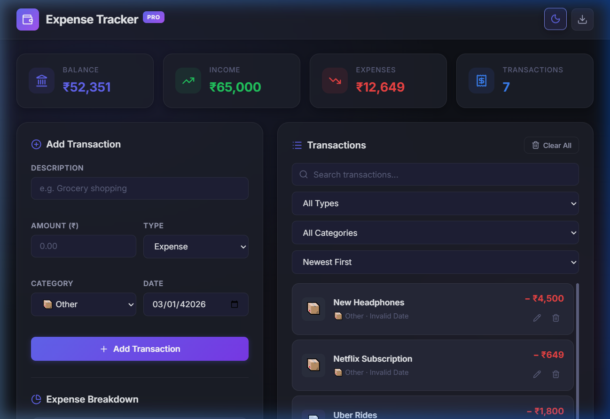
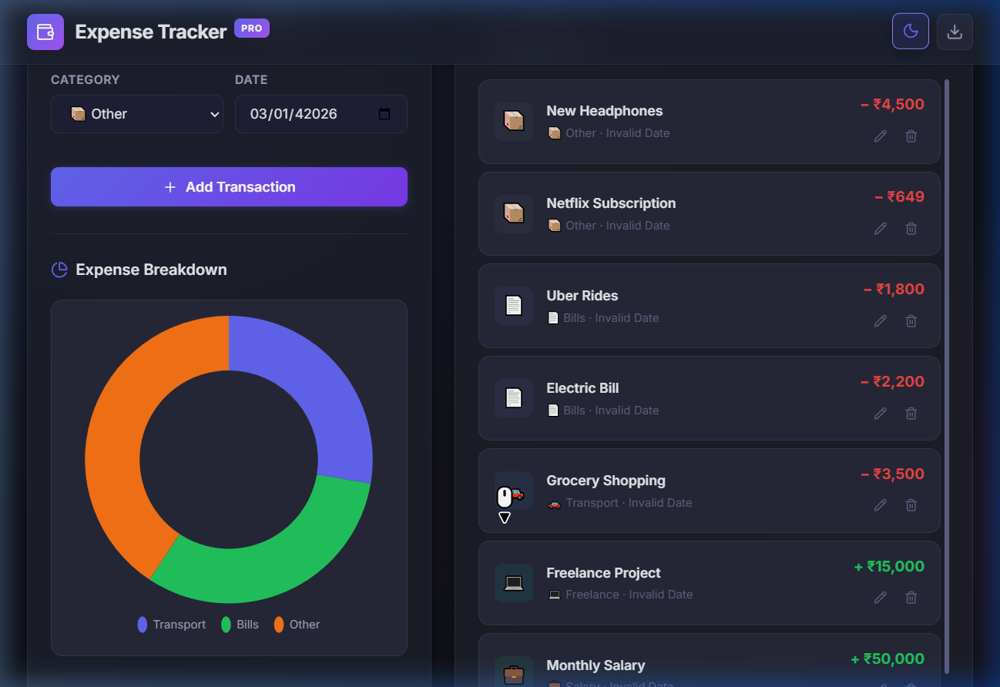
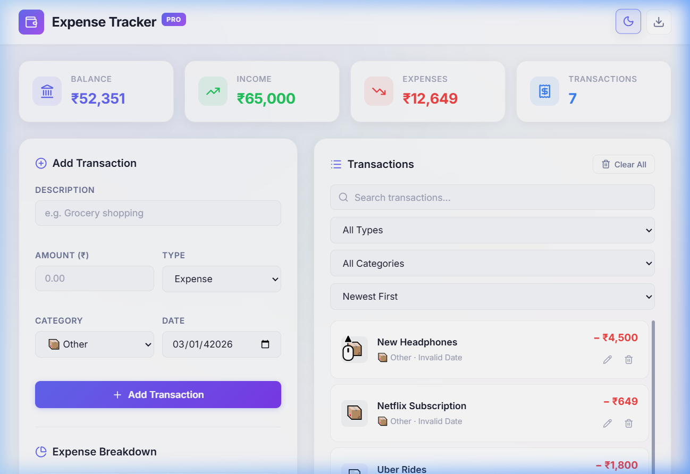
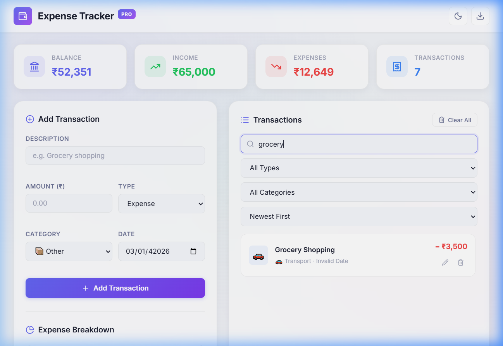

# 💰 Expense Tracker Pro

A modern, feature-rich personal finance dashboard built to elegantly track your income, expenses, and overall budget. Seamlessly visualize your financial trends and stay on top of your money — all wrapped in a premium, responsive glassmorphism UI.

**🌍 Live Demo:** [https://aruntv1407.github.io/expense-tracker/](https://aruntv1407.github.io/expense-tracker/)

## 🌟 Demo & Screenshots

### Dashboard Overview


### Dark Mode


### Deep Analytics


### Transaction Management


### Smart Search & Filtering


---

## 🚀 Features

### Core Capabilities
- ✅ **Income & Expense Tracking**: Add, edit, and safely delete your financial records.
- ✅ **Rich Categorization**: Pre-built categories (8 expense, 5 income) equipped with visual emojis.
- ✅ **Smart Calculations**: Automatic updates for Balance, Total Income, and Total Expense.
- ✅ **Data Persistence**: Data safely secured in your browser's LocalStorage.

### Visualizations & Analytics
- 📊 **Doughnut Chart**: Granular expense breakdown by configured categories.
- 📈 **Monthly Trends**: Bar chart visualizing income versus expenses over time using Chart.js.

### Smart Data Access
- 🔍 **Real-time Search**: Search across transaction descriptions, categories, and amounts instantly.
- 🏷️ **Advanced Filtering**: Filter transactions exactly by type (Income/Expense) and specific category.
- 🔃 **Sorting Flexibility**: Organize transactions by Date (Newest/Oldest) or Amount (Highest/Lowest).

### Advanced Tools
- 📥 **CSV Data Export**: Easily download all transaction records to a CSV file.
- 🗑️ **Bulk Clear**: Quickly reset dashboard data with a secure confirmation prompt.
- ✏️ **In-Place Editing**: Tweak descriptions, amounts, dates, and types seamlessly through a modal interface.

### Premium UX
- 🌗 **Light / Dark Theme Customization**: Native theme toggling that persists across sessions.
- 🎨 **Glassmorphism Design System**: Dynamic gradients, sleek blur effects, and fine-tuned shadows.
- 📱 **Fully Responsive**: Flawless experience across mobile, tablet, and desktop interfaces.
- 🔔 **Interactive Feedback**: Contextual toast notifications for CRUD and export actions.
- ♿ **Accessibility Ready**: Fully semantic HTML layout, ARIA labels, and proper keyboard navigation.

---

## 🛠️ Tech Stack Used

| Technology | Purpose |
|------------|---------|
| **HTML5** | Semantic, accessible core page structure |
| **CSS3** | Glassmorphism design patterns, responsive CSS Grid layout, and micro-animations |
| **JavaScript (ES6+)** | Application logic, form validation, and DOM manipulation |
| **[Chart.js](https://www.chartjs.org/)** | Dynamic rendering of Doughnut and Bar charts |
| **[Lucide Icons](https://lucide.dev/)** | Open-source SVG icons for intuitive UX |
| **[Google Fonts](https://fonts.google.com/specimen/Inter)** | Modern typography using 'Inter' |

---

## 📂 Folder Structure

```text
expense-tracker/
├── assets/
│   └── screenshots/  # Captured application UI states
├── index.html        # Main HTML5 page template
├── style.css         # Extensible CSS design system
├── script.js         # Core application logic & data handling
└── README.md         # Project documentation
```

---

## 🏃 Installation Steps

The Expense Tracker Pro works straight out of the box in your web browser. No complex build pipelines are needed!

1. Clone the repository:
   ```bash
   git clone https://github.com/aruntv1407/expense-tracker.git
   ```
2. Navigate into the directory:
   ```bash
   cd expense-tracker
   ```
3. Open `index.html` in your favorite web browser:
   - On Windows: Double-click `index.html` directly from File Explorer.
   - On Mac: `open index.html` from the terminal.
   - Alternatively, serve it via Live Server in VS Code!

---

## 📖 Usage Instructions

1. **Add a Transaction**: Navigate to the "Add Transaction" form, enter a valid description, amount, select its type (Income/Expense), categorize it, and pick a date. Click "Add Transaction".
2. **Review Analytics**: Scroll through the left-hand panel to view auto-generated breakdowns and monthly trends based on your active datasets.
3. **Manage Data**: Under the Transactions area, use the Pencil icon to edit an entry or the Trash icon to delete it. Use the Search box and filter dropdowns to narrow down records.
4. **Export to CSV**: Click the Download icon in the top right to download your records natively via a spreadsheet-ready `.csv` file.
5. **Change Theme**: Hit the Moon/Sun icon on the Header to toggle between Dark Mode and Light Mode.

---

## 🔮 Future Improvements

- [ ] **Database Integration**: Connect to Firebase or Supabase for multi-device data syncing.
- [ ] **User Authentication**: Add login capabilities so user datasets remain entirely private remotely.
- [ ] **Custom Categories**: Allow users to dynamically create new overarching categories rather than using predefined ones.
- [ ] **Multiple Currencies**: Add support for global currencies alongside the default Indian Rupee (`₹`).
- [ ] **Budgeting**: Set hard expense limits and notify users when budgets approach capacity.

---

## 👨‍💻 Author

**Arun T V**  
Computer Science Engineering Student  
*Passionate about web development and building real-world projects.*