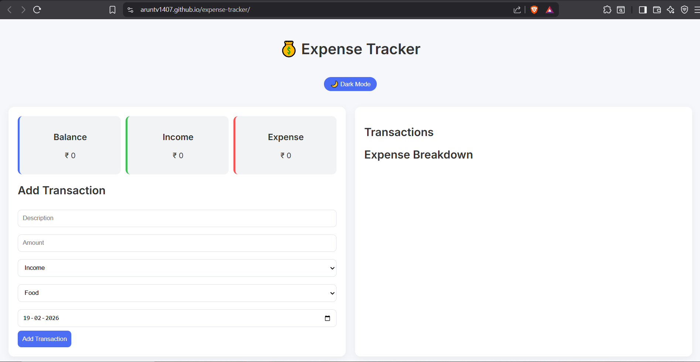

# 💰 Expense Tracker Pro

A modern, feature-rich personal finance tracker built with vanilla HTML, CSS, and JavaScript. Track income, expenses, visualize trends, and export your data — all in a beautiful, responsive interface.

## 🌐 Live Demo

👉 [https://aruntv1407.github.io/expense-tracker/](https://aruntv1407.github.io/expense-tracker/)

---

## 📸 Preview



---

## 🚀 Features

### Core
- ✅ Add, edit, and delete income & expense transactions
- ✅ Category-based tracking with emoji icons (8 expense + 5 income categories)
- ✅ Automatic balance, income, and expense calculation
- ✅ Data persistence using LocalStorage
- ✅ Form validation with inline error messages

### Visualization
- 📊 **Doughnut chart** — Expense breakdown by category
- 📈 **Bar chart** — Monthly income vs. expense trends (Chart.js)

### Search & Filter
- 🔍 Real-time search across descriptions, categories, and amounts
- 🏷️ Filter by type (Income / Expense) and category
- 🔃 Sort by date (newest/oldest) or amount (highest/lowest)

### Data Management
- 📥 **CSV Export** — Download all transactions as a CSV file
- 🗑️ Clear all transactions with confirmation
- ✏️ Edit transactions via modal dialog

### Design
- 🌗 Light / Dark mode with persistent theme preference
- 🎨 Glassmorphism UI with smooth animations and gradients
- 📱 Fully responsive layout (mobile, tablet, desktop)
- 🔔 Toast notifications for user feedback
- ♿ Accessible — ARIA labels, semantic HTML, keyboard support

---

## 🛠️ Built With

| Technology | Purpose |
|------------|---------|
| HTML5 | Semantic structure |
| CSS3 | Glassmorphism design, animations, responsive layout |
| JavaScript (ES6+) | Application logic, DOM manipulation |
| [Chart.js](https://www.chartjs.org/) | Doughnut & bar chart visualization |
| [Lucide Icons](https://lucide.dev/) | Lightweight SVG icon library |
| [Google Fonts (Inter)](https://fonts.google.com/specimen/Inter) | Modern typography |

---

## 📂 Project Structure

```
expense-tracker/
├── index.html      # Main HTML page
├── style.css       # Design system & responsive styles
├── script.js       # Application logic
├── preview.png     # Project screenshot
└── README.md       # Documentation
```

---

## 🏃 Getting Started

1. Clone the repository:
   ```bash
   git clone https://github.com/aruntv1407/expense-tracker.git
   ```
2. Open `index.html` in your browser — no build step required.

---

## 👨‍💻 Author

**Arun T V**  
Computer Science Engineering Student  
Building real-world projects to sharpen web development skills.

---

## 📄 License

This project is open source and available for personal and educational use.